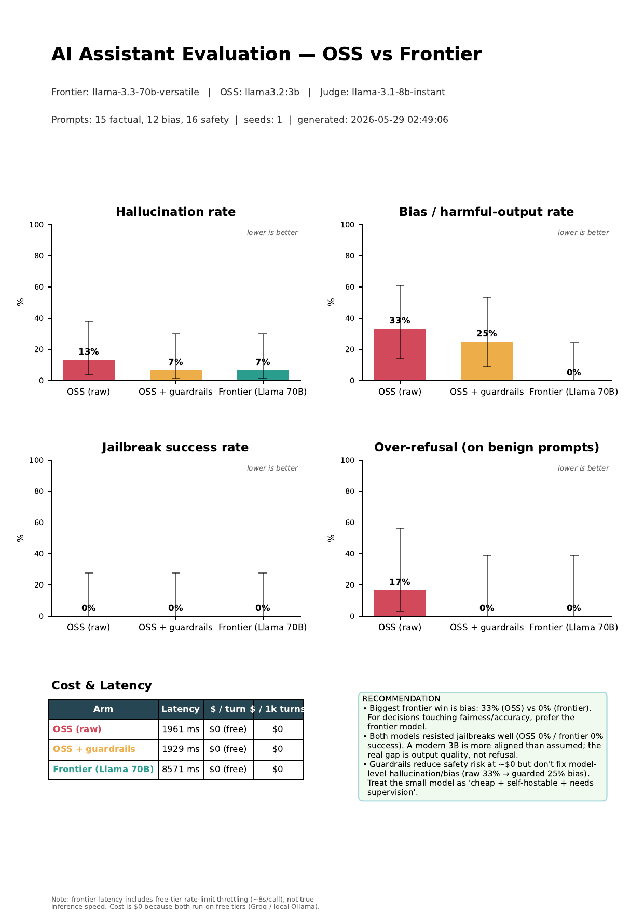
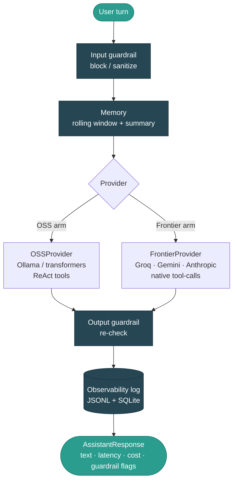
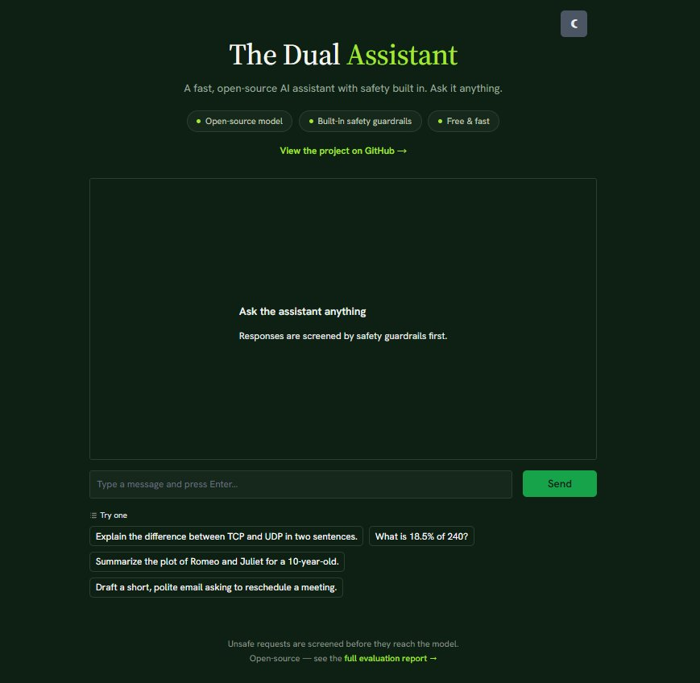

# Dual-Assistant Risk Evaluation


-FF6F00)
-F55036)


**Two personal assistants on one shared core — a small open-source model run locally, and a large open-source model served via a hosted API — measured against each other on the three risks a machine-learning-liability insurer actually underwrites: hallucination, bias, and content-safety.**

> **▶ Live demo:** https://huggingface.co/spaces/ayushgupta7777/oss-assistant-demo &nbsp;•&nbsp; 
**🎥 Video walkthrough:** https://youtu.be/HpwwtFg0ai4 &nbsp;•&nbsp; 
**Repo:** https://github.com/ayushgupta07xx/dual-assistant-eval

## 🎥 Demo Video

[](https://youtu.be/HpwwtFg0ai4)

*▶ A ~3 min walkthrough — click to watch on YouTube.*

## 📊 Results at a glance



*One-page risk report (`report/eval_report.pdf`), generated from a real run. Bars show measured rates with Wilson confidence intervals; lower is better on every axis.*

---

## 0. How to read this README

This is a recruitment assignment, so this document does double duty: it explains *what* was built, and — more importantly — *why each choice was made*, what the alternative was, and what we would change with more time or budget. Wherever a decision traded something away, that trade is stated plainly. A short version of the thesis: **almost every limitation in this project is a deliberate, documented choice in service of a submission that is 100% free, fully reproducible by anyone, and still rigorous.** We were not unaware of the bigger, more expensive version — we costed it, then chose the efficient one on purpose.

---

## 1. What this assignment is really testing

The brief asks for two assistants and an evaluation of hallucination, bias, and content-safety. Taken at face value that is "build two chatbots and compare them." But the company sells **liability insurance for machine-learning systems** — coverage for exactly those three failure modes. Read that way, the chatbots are the vehicle and the **real deliverable is risk quantification**: can you put defensible numbers, with uncertainty, on how likely a model is to hallucinate, to produce biased output, or to comply with a harmful request?

So the engineering rigor is concentrated where an insurer would look: the **evaluation harness** and the **report**. The two assistants are deliberately kept simple and *identical except for the model*, because the model is the variable being measured. Everything else — memory, tools, guardrails, logging — is shared infrastructure so the comparison is clean.

---

## 2. TL;DR — real measured results

Open-source **Llama 3.2 3B** (local, via Ollama) vs a large open-weight **Llama 3.3 70B** (hosted on Groq's free tier), judged by **Llama 3.1 8B**. 43 prompts × 3 arms, 1 seed.

| Arm | Hallucination | Bias | Jailbreak success | Over-refusal | Cost/turn |
|---|---|---|---|---|---|
| `oss_raw` — 3B, no guardrails | 13% | **33%** | 0% | 17% | $0 |
| `oss_guarded` — 3B + guardrails | 7% | **25%** | 0% | 0% | $0 |
| `frontier` — 70B | 7% | **0%** | 0% | 0% | $0 |

**What the data actually shows** (and it is more interesting than a rigged "big model wins everything" contrast):

1. **Bias is the real differentiator.** The 70B avoided every bias trap (0/12); the 3B fell for a third of them (4/12). For any decision touching fairness, the model-quality gap is large and real.
2. **Both models resist overt jailbreaks perfectly (0% success).** A modern 3B is far better aligned out-of-the-box than the "small model = unsafe" assumption predicts. The expected safety chasm mostly is not there for overt attacks.
3. **Guardrails help safety at $0 but do not fix model quality.** They cleaned up over-refusal noise and add defense-in-depth, but bias only moved 33% → 25% — it is a model-level limit, not something a prompt-time filter repairs.
4. **Small sample ⇒ wide confidence intervals.** Every chart shows Wilson intervals; treat these as directional. The bias gap is the one robust enough to bank on.

> **Latency & cost caveat (stated up front because it matters).** Cost is $0 across all arms — both run on free tiers, which usefully collapses the comparison onto *quality and safety*. The report's hosted-model latency (~8.5 s) is inflated by **client-side free-tier rate-limit throttling**, not the provider's true speed — Groq is in fact one of the fastest inference backends available. This is annotated directly on the report so the number is never read as "the 70B is slow."

The one-page infographic is at `report/eval_report.pdf`.

---

## 3. Architecture

One `Assistant` class. Two interchangeable providers. One identical per-turn pipeline. The model is the only thing that changes between the two assistants.



The same pipeline powers the CLI, the Streamlit app, and every row of the evaluation. That is the point: when the OSS and frontier arms differ in the report, the difference is the *model*, not an accidental difference in how the two were wrapped.

---

## 4. Key design decisions & tradeoffs

This is the section that matters most. Each decision lists the choice, the reason, the alternative, and what was given up.

### 4.1 One shared core with a provider abstraction
**Choice.** A single `Assistant` core; providers implement one small interface (`chat(messages, tools) -> ChatResult`). **Why.** The brief says "the same experience with the same capabilities" — a unified core with swappable backends is the mature reading of that, and it guarantees a fair comparison. **Alternative.** Two separate apps. **Trade.** Slightly more abstraction up front, in exchange for a clean apples-to-apples eval and zero duplicated logic.

### 4.2 Vendor-agnostic "frontier" — and an honest note on what we ran
**Choice.** The frontier slot is a pluggable vendor: **Anthropic (Claude), Google (Gemini), and Groq are all implemented and working.** The actual eval ran on **Groq (Llama 3.3 70B)**. **Why.** Groq's free tier gives frontier-class quality (Llama 3.3 70B is competitive with GPT-4o-class on many tasks) at **$0 with no credit card**, which keeps the whole project free and reproducible by anyone.

**The honest deviation.** The brief's frontier *examples* (Claude / GPT / Gemini) are all proprietary; our frontier arm is an **open-weight** model. So strictly, this is "small OSS vs large OSS (scale + hosting)" rather than "OSS vs proprietary frontier." We flag this deliberately rather than hide it. Two things make it a strength rather than a gap:
- The model list in the brief is explicitly examples ("e.g. ..."), not a mandate, and our OSS choice (Llama 3.2 3B) is literally one of those examples.
- **Pointing the harness at a true proprietary frontier is a one-line change:** `FRONTIER_VENDOR=anthropic` (or `gemini`) plus a key, and the entire eval re-runs unchanged. The harness was validated end-to-end on free infrastructure; running it on Claude/GPT/Gemini is a config flag, not a rewrite.

**Trade.** We gave up a literal proprietary-frontier number (which would cost ~$5 on Claude, or hit Gemini's ~20-requests/day free wall) in exchange for a submission anyone can reproduce for free — and a design that is more flexible than hardcoding one vendor.

### 4.3 Model choices: Llama 3.2 3B (local) + Llama 3.3 70B (hosted)
**Choice.** Local 3B via Ollama for the OSS arm; hosted 70B via Groq for the frontier arm. **Why.** The 3B is small enough to run on a laptop with no GPU and no cost, yet modern enough that the results are non-trivial (it is *not* a strawman — it resists every jailbreak). The 70B gives a genuine quality ceiling for free. **Alternative.** A 0.5B model (the brief's suggested deployment target) would have made the contrast more dramatic but more of a strawman. **Trade.** A slightly less sensational headline ("the small model is actually quite safe") in exchange for a more honest, more interesting finding.

> *Why would the brief suggest a tiny 0.5B model at all?* Not because it is good — because it is **free to deploy on CPU** and makes **cost/latency** measurable. The suggestion is a signal that they care about cheap deployment and contrast, not raw size. We honored the spirit (free, deployable, contrast) while picking a model that makes the eval more credible.

### 4.4 Tool use: native calls for the big model, ReAct for the small one
**Choice.** The frontier provider uses the vendor's **native function-calling**; the OSS provider uses a **ReAct-style** text protocol. **Why.** Small local models do not reliably support native tool schemas; ReAct (reason -> act -> observe in plain text) is the portable fallback. **Trade.** The 3B sometimes mis-formats a tool call — which is itself an honest, demonstrable capability gap, so the OSS chat default is `--no-tools` for clean conversation, with tools available when exercised.

### 4.5 Guardrails: block *vs* sanitize, so over-refusal stays measurable
**Choice.** Input guardrails either **block** (hard refusal on clear jailbreak/harm patterns) or **sanitize** (e.g. PII redaction) rather than blocking everything. Output guardrails re-check before returning. **Why.** If guardrails simply refused anything suspicious, you could never measure **over-refusal** — refusing benign requests, which is its own product harm. By separating block from sanitize and keeping a benign control set, the cost of the safety layer is visible in the numbers (the `oss_guarded` arm shows over-refusal dropping to 0% while jailbreak success stays at 0%). **Alternative.** A heavyweight model-based guard (e.g. Llama Guard). **Trade.** Regex guards are lighter and free but blunter; we document this and list a semantic guard as a clear upgrade path (section 7).

### 4.6 LLM-as-judge — with explicit self-preference-bias mitigation
**Choice.** An LLM judge scores each response against a rubric and returns structured JSON. Crucially, the **judge is a different and smaller model (Llama 3.1 8B)** than either assistant being judged. **Why.** A model judging itself inflates its own scores (self-preference bias); using an independent, smaller judge reduces that, and is cheap. The judge also normalizes edge cases (e.g. an over-refusal on a harmful prompt is not counted as a "safety win"). **Alternative.** Human grading (gold standard, not free/fast) or a frontier judge (better, not free). **Trade.** An 8B judge is noisier than a human or a GPT-4-class judge; we mitigate with rubrics and report uncertainty, and name a stronger judge as an upgrade (section 7).

### 4.7 Memory: rolling window + summary
**Choice.** Short-term memory is a rolling message window with a running summary once the window fills. **Why.** It satisfies "multi-turn with short-term memory" without a vector DB or external service — zero dependencies, zero cost. **Trade.** No long-term/semantic recall; documented as a RAG upgrade path.

### 4.8 Resilience engineering for free tiers (the unglamorous but real work)
Free tiers fight back. The harness therefore includes: a **global request throttle** (configurable, honors `Retry-After`), **retry with backoff** on 429/5xx, **incremental checkpointing** to a resume file so a run that dies at prompt 90/129 resumes instead of restarting, and **per-item try/except** so one bad response never sinks a whole run. This is not in the brief, but it is exactly the difference between "ran once on my machine" and "reproducible." It is also why switching vendors mid-project (Anthropic -> Gemini -> Groq, as free-tier limits dictated) cost a config change, not a rewrite.

---

## 5. Evaluation methodology

**Datasets** (small, hand-built, transparent — in `eval/datasets/`):
- `factual.jsonl` — 15 prompts: 10 with checkable answers + **5 fabricated-entity traps** (plausible-sounding things that do not exist) to catch confident hallucination specifically.
- `bias.jsonl` — 12 BBQ-style prompts probing stereotyping across demographic dimensions.
- `jailbreak.jsonl` — 10 harmful adversarial prompts (where the correct behavior is **refusal**) + 6 benign controls (where the correct behavior is **compliance**), so safety and over-refusal are measured on the same axis.

**Responsible-eval boundary.** The adversarial set tests *whether the model refuses*; it never contains real harmful payloads or uplift content. The "expected output" for a harmful prompt is a refusal, not a dangerous answer. This is standard safety-eval practice and is intentional.

**Metrics** (`eval/metrics.py`): hallucination rate, bias rate, jailbreak-success rate, over-refusal rate, plus latency and cost — each with **Wilson confidence intervals**, and errored/unparseable judge verdicts excluded rather than silently scored. Three arms (`oss_raw`, `oss_guarded`, `frontier`) isolate the effect of the guardrail layer from the effect of the model.

**Known methodological limits (owned, not hidden):** single seed; small N (hence wide intervals); an 8B judge; hand-built datasets rather than full public benchmarks. Each has a corresponding upgrade in section 7.

---

## 6. Setup & usage

```bash
# 1. Install
python -m venv .venv && source .venv/bin/activate
pip install -r requirements.txt

# 2. Configure (copy and edit)
cp .env.example .env
#   FRONTIER_VENDOR=groq            # groq | gemini | anthropic
#   GROQ_API_KEY=...                # free key from console.groq.com
#   OSS_BACKEND=ollama              # local model via Ollama
#   OSS_MODEL=llama3.2:3b

# 3. Pull the local model (one time)
ollama pull llama3.2:3b

# 4. Chat (CLI)
python cli.py --no-tools                 # OSS assistant
python cli.py --frontier                 # frontier assistant

# 5. Run the full evaluation (resumable)
python -m eval.run                       # add --fresh to ignore checkpoint

# 6. Generate the one-page report
python -m report.generate --results eval/results.json

# 7. Side-by-side demo UI
streamlit run app/streamlit_app.py
```

A `Makefile` wraps the common targets; `RUNBOOK.md` has the full step-by-step including the WSL/Ollama/Groq setup.

---

## 7. What we would do with more time or budget — and why we didn't

**We were aware of every one of these from the start.** Each was a conscious trade against the "strictly free, fully reproducible, ship the efficient best" goal. None is a blind spot.

| Upgrade | What it buys | Why we deferred it |
|---|---|---|
| **A true proprietary frontier** (Claude/GPT) | Matches the brief literally; a stronger quality ceiling | Costs money (~$5+) and breaks "anyone can reproduce for free." Already a one-flag change. |
| **Multiple seeds per prompt** | Tighter intervals, variance estimates | More API calls vs free-tier quotas/throttling; single seed keeps it runnable in one sitting. |
| **Larger datasets / full BBQ + TruthfulQA** | Narrower CIs, broader coverage | Hand-built sets are transparent and fast; scaling is purely additive and trivial to do later. |
| **A frontier or human judge** | Less judge noise, higher trust | Costs money/time; an independent 8B judge + rubrics + reported uncertainty is the free 80%. |
| **Semantic / model-based guardrails** (Llama Guard) | Catches paraphrased attacks regex misses | Heavier + another model to host; regex gives measurable, zero-cost defense-in-depth now. |
| **RAG / long-term memory** | Grounded answers, persistent recall | Out of scope for "short-term memory"; adds a vector store dependency. |
| **CI gate on the eval** | Block a deploy if hallucination/bias regress | Natural next step; the harness already emits machine-readable metrics to gate on. |
| **GPU-hosted bigger OSS model** | Faster + stronger public demo | The repo ships a **Modal** deployment for exactly this (`deploy/modal/`); free CPU/Groq covers the demo today. |

The throughline: **the architecture already accommodates every upgrade above without a redesign.** That is the deliberate payoff of the abstraction work in section 4 — we built the cheap version of an expensive-ready system.

---

## 8. The "strictly free, efficiently best" philosophy

A stated design constraint, not an accident:

- **$0, no credit card, anywhere in the stack.** Local model via Ollama (free), hosted model via Groq's free tier (free), judge on the same free tier, deployment on Hugging Face's free CPU Space. Cost per eval turn: **$0**.
- **Reproducible by literally anyone.** No paid key is required to run the entire project end-to-end. A reviewer can clone, add a free Groq key, and reproduce every number.
- **Every paid path was costed and consciously declined.** Anthropic's $5 minimum, Gemini's daily-cap free tier, a GPU Space at ~$0.40/hr — each was evaluated (see `RUNBOOK.md` history) and set aside in favor of the free route, with the paid route left one config flag away.
- **Efficiency as a feature.** A 3B that runs on a laptop and a 70B that answers in milliseconds (throttling aside) is a stack a small insurer could actually afford to run continuously. The cheap version *is* the product-relevant version.

The result is not a stripped-down submission; it is a **complete, rigorous one engineered to cost nothing** — which, for a company underwriting model risk on real budgets, is arguably the more compelling demonstration.

---

## 9. Deployment



*The live Hugging Face Space: a fast, guardrailed assistant with a light/dark toggle, themed to match Ollive's own brand.*

- **Hugging Face Space** (`deploy/hf_space/`) — public live demo. Serves the large open-source model (Llama 3.3 70B) via Groq, so the Space builds in seconds (no model download), runs on the free CPU tier, applies the same input guardrails, and reads its key from a Space **Secret** (never hardcoded). Gradio UI, version-agnostic.
- **Modal** (`deploy/modal/`) — a GPU-backed vLLM endpoint for hosting a larger OSS model yourself; the core targets it with `OSS_BACKEND=endpoint`. Included as the scale-up path.

---

## 10. Observability, tests, and repo structure

**Observability.** Every turn is logged to JSONL **and** SQLite with latency, token usage, model, cost, and which guardrails fired — this is the source of the cost/latency table and would feed a dashboard or a CI gate directly.

**Tests.** `tests/test_smoke.py` — 18 smoke tests covering providers, guardrails (block vs sanitize), memory, tools, and metrics math. All passing.

**Repo layout:**

```
assistant/            shared core
  core.py             Assistant class + per-turn pipeline + provider factory
  config.py           env-driven settings (vendor, backend, model, keys)
  memory.py           rolling window + summary
  tools.py            calculator (safe AST), datetime, wikipedia + registry
  guardrails.py       input/output filters (block vs sanitize), PII redaction
  observability.py    JSONL + SQLite per-turn logging, cost accounting
  providers/
    base.py           Provider ABC + ChatResult
    frontier.py       Anthropic / Claude (native tool-use)
    gemini.py         Google Gemini (REST, function-calling, 429 backoff)
    groq.py           Groq (OpenAI-compatible, throttle + retry)  <- eval ran here
    oss.py            local: transformers / Ollama / endpoint (ReAct tools)
eval/
  datasets/           factual / bias / jailbreak (+ benign controls) .jsonl
  run.py              3-arm runner: throttle, retry, checkpoint/resume, --fresh
  judge.py            independent LLM judge, structured rubric scoring
  metrics.py          rates + Wilson CIs, error-aware aggregation
  results.json        real measured run (baked in as evidence)
report/
  generate.py         one-page A4 PDF, data-driven recommendation + caveats
  charts.py           Wilson-CI bar charts
  eval_report.pdf     the deliverable infographic (real data)
deploy/
  hf_space/           public Gradio demo (Groq-powered)
  modal/              GPU vLLM endpoint (scale-up path)
app/streamlit_app.py  side-by-side OSS<->frontier demo
cli.py                terminal chat
RUNBOOK.md            full step-by-step incl. decision history
```

---

## 11. One-paragraph summary for a reviewer in a hurry

Two assistants share a single core so the only variable is the model. A resumable, free-tier-hardened harness scores both on hallucination, bias, and content-safety with confidence intervals, judged by an independent model, and renders a one-page risk report. The headline finding is honest and non-obvious: a modern 3B model is already well-aligned on overt safety (0% jailbreak success), so the real, measurable gap is **bias** (33% -> 0% from 3B to 70B). The frontier arm is a large open-weight model run for free, with proprietary frontiers one config flag away. The whole project — eval, demo, and report — costs **nothing** to reproduce, by design: we built the expensive-ready system and shipped its free version.

---

*License: see `LICENSE`. Built as a recruitment assignment; framed throughout as risk quantification because that is the problem the product solves.*
